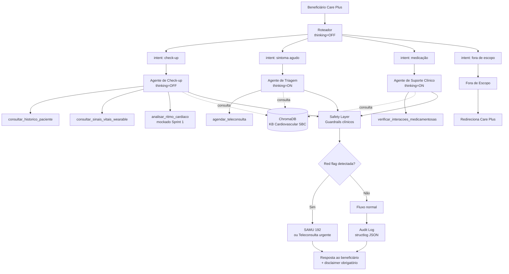

<!--
  README.md — BluaDiagnostics
  Care Plus | Plataforma Blua
  Sprint 1 — PoC Acadêmica FIAP
  Versão: 1.0.0 | 2026-05-15
-->

# BluaDiagnostics

> **Assistente clínico digital especializado em saúde cardiovascular**
> da Care Plus — chatbot multi-agente em Português Brasileiro nativo,
> integrado ao app Blua, que conduz check-up digital conversacional,
> analisa ritmo cardíaco via modelo de Machine Learning e apoia
> prescrição remota assistida (sempre com aprovação médica humana).
> Sprint 1 de PoC acadêmica FIAP.
>
> **Projeto Colab-first**: o ponto de entrada canônico é o notebook
> [`notebooks/sprint1_poc.ipynb`](notebooks/sprint1_poc.ipynb),
> executado no Google Colab.

---

## Integrantes

- Lucas Gabriel Alvarenga e Meireles — RM 567305
- Gabriel Augusto da Silva — RM 567057
- Leonardo Kenji Kubo Barboza — RM 567518
- Lucas Koiti Uyeno de Souza — RM 568128
- Lucas Morio Ikeda — RM 567616

---

## Persona escolhida e justificativa

**Persona principal**: beneficiário Care Plus em autoavaliação —
paciente leigo realizando check-up digital cardiovascular ou
triagem de sintomas cardíacos.

**Foco clínico**: saúde cardiovascular e sistema circulatório
exclusivamente. Qualquer condição fora desse escopo é
redirecionada para o canal adequado da Care Plus.

**Justificativa da persona:**

A Care Plus possui mais de 600 mil beneficiários no Brasil.
Doenças cardiovasculares são a principal causa de morte no país
(SBC, 2025). O beneficiário leigo em autoavaliação é o público
de maior volume e maior risco — um check-up digital cardiovascular
bem conduzido reduz tempo de diagnóstico, previne eventos agudos
e melhora o NPS do app Blua.

**Justificativa do foco cardiovascular:**

A especialização foi uma decisão técnica e de segurança. Um
agente especializado em cardiovascular tem base de conhecimento
mais precisa, guardrails mais objetivos e menor risco de
alucinação clínica do que um agente generalista. Além disso,
integra diretamente o modelo de Machine Learning de detecção
de arritmias desenvolvido pelo grupo — conectando dois trabalhos
acadêmicos num sistema coeso.

---

## Stack técnica

| Camada | Tecnologia |
|---|---|
| Ambiente de execução | **Google Colab** (Python 3.11, CPU runtime gratuito) |
| LLM principal | Qwen (`qwen-plus` via DashScope International) |
| Modelo de ML | Detecção de arritmias por janela deslizante de IBI — integrado via tool `analisar_ritmo_cardiaco` |
| SDK | `openai` Python (Qwen é OpenAI-compatible) + `qwen-agent` (demo) |
| Orquestração multi-agente | LangGraph (`StateGraph` + `MemorySaver`) |
| RAG | `langchain-text-splitters` + ChromaDB + `intfloat/multilingual-e5-large` |
| Memória curto prazo | LangGraph `MemorySaver` |
| Memória longo prazo | JSON estruturado por `beneficiario_id` |
| Validação | Pydantic v2 |
| Logging estruturado | `structlog` (output JSON em `logs/`) |
| Avaliação | LLM-as-a-judge com Qwen — 15 casos cardiovasculares |
| Segredos | **Google Colab Secrets** (preferencial) ou `python-dotenv` local |

---

## Arquitetura

Arquitetura completa em [`docs/arquitetura_mermaid.md`](docs/arquitetura_mermaid.md)
e [`docs/arquitetura.png`](docs/arquitetura.png).

**Quatro agentes especializados**: Roteador → (Check-up |
Triagem | Suporte Clínico | Fora-de-escopo) → Safety Layer
→ Audit Log, com `thread_id` preservando memória multi-turno.

**Diferencial**: o Agente de Check-up integra o modelo de ML
de detecção de arritmias via tool `analisar_ritmo_cardiaco`,
recebendo 6 atributos calculados a partir do IBI e retornando
classificação `regular` ou `irregular`.

---

## Comparação de modelos: Qwen vs Llama 3.3 70B

Detalhes completos em [`docs/decisao_modelo.md`](docs/decisao_modelo.md).

### Critérios obrigatórios

| Critério | Qwen qwen-plus (escolhido) | Llama 3.3 70B |
|---|---|---|
| **Latência** | ~800ms via DashScope cloud | >60s em CPU — GPU T4 necessária |
| **Custo** | Gratuito — 1M tokens/90 dias free trial DashScope | Gratuito — mas exige GPU paga no Colab ou Groq com risco LGPD |
| **Privacidade / LGPD** | Dado transita pelo DashScope Internacional. Mitigação: modo Ollama on-prem disponível | Groq: dado transita fora do Brasil. On-prem: resolve LGPD mas inviável no Colab gratuito |
| **Qualidade clínica** | IFBench 76,5 — instruction following superior, PT-BR nativo, 201 idiomas | IFBench ~71 — bom, sem foco clínico em português |

### Critérios técnicos adicionais

| Critério | Qwen | Llama 3.3 70B |
|---|---|---|
| Lançamento | 2025–2026 | Dez/2024 |
| Function calling | Nativo OpenAI-compatible | Suportado, mais reescrita |
| Hybrid thinking mode | Sim — toggle por agente | Não |
| Contexto | Até 1M tokens | 128K tokens |
| Licença | Apache 2.0 | Llama Community License |
| Disponibilidade Colab CPU | Sim — inferência em cloud | Não — exige GPU |

### Decisão: Qwen

1. **Instruction following (IFBench 76,5)** — crítico para
   guardrails clínicos respeitarem restrições invioláveis.
2. **PT-BR nativo** — reduz alucinação terminológica em bulas
   e protocolos da SBC.
3. **Hybrid thinking mode** — `thinking=ON` nos agentes de
   triagem e suporte, `thinking=OFF` no roteador.
4. **Compatível com Colab CPU** — inferência em cloud sem GPU.
5. **Apache 2.0** — sem restrições comerciais.

**Risco LGPD documentado**: dados transitam pelo DashScope
Internacional. Mitigação na Sprint 1: dados mockados sem PII
real. Mitigação no projeto final: modo Ollama on-prem com
Qwen 14B+ rodando em servidor local.

---

## Modos de deployment (apenas uma demonstração)

| Modo | Quando usar | Backend |
|---|---|---|
| **A — Cloud DashScope** (padrão Colab) | Sprint 1 — PoC | `qwen-plus` em `dashscope-intl.aliyuncs.com` |
| **B — On-prem Ollama** (projeto final) | Isolamento total, LGPD, produção | `qwen:14b` em `localhost:11434` |

Troca via parâmetro: `chat(..., backend="dashscope" or "ollama")`.
**No Colab, use sempre `dashscope`**.

---

## Mapeamento de riscos clínicos e LGPD

| Risco | Origem | Mitigação |
|---|---|---|
| Alucinação clínica | LLM gera fato falso sobre condição cardiovascular | RAG com KB cardiovascular curada + Safety Layer + disclaimer obrigatório |
| Viés algorítmico | Treino do modelo com dados não representativos | Lógica determinística em `classificar_risco_clinico`; auditoria periódica |
| LGPD art. 7º/11/18 | Dado clínico em cloud | Dados mockados na Sprint 1; Ollama on-prem no projeto final |
| Responsabilidade sobre prescrição (CFM Res. 2.314/22) | Conduta farmacológica sem médico | Agente nunca emite receita; tag `[RASCUNHO_AGUARDANDO_REVISAO_MEDICA]`; aprovação médica obrigatória |
| Atrasar emergência | Triagem digital substituindo SAMU | Red flag → SAMU 192 imediato, sem coleta adicional |
| Overtrust | Confiança excessiva no assistente | Disclaimer obrigatório; linguagem probabilística; recusa de diagnóstico |
| Jailbreak por autoridade | Usuário alega ser médico | Restrição independente de autodeclaração — escopo não muda |

---

## Como rodar a PoC no Google Colab

### Pré-requisitos

- Conta Google.
- Chave **DashScope International**
  (<https://bailian.console.alibabacloud.com>) com **Model
  Studio** ativado (1 milhão de tokens grátis por 90 dias).
- Repositório disponível no GitHub ou `.zip` para upload.

### Passo a passo

1. **Suba o projeto ao Colab**:
   - **GitHub**: edite `REPO_URL` na Seção 1.1 do notebook.
   - **Upload manual**: `!unzip bluadiagnostics.zip -d /content/`

2. **Configure o Colab Secret**:
   - Ícone 🔑 → **+ Add new secret**
   - Name: `DASHSCOPE_API_KEY` | Value: sua chave
   - Habilite **Notebook access**

3. **Execute `notebooks/sprint1_poc.ipynb`** em ordem:
   - Seção 1: instala deps (~3 min), carrega secret
   - Seção 2: baixa embeddings (~1 GB), indexa KB cardiovascular
   - Seções 3–6: valida tools, Qwen wrapper e grafo LangGraph
   - Seções 7–12: 6 demos clínicas cardiovasculares
   - Seção 13: eval set (15 casos) com LLM-as-a-judge

### Solução de problemas

| Erro | Causa | Como resolver |
|---|---|---|
| `DASHSCOPE_API_KEY não encontrada` | Secret sem Notebook access | Reabra 🔑 e habilite Notebook access |
| `403 AccessDenied.Unpurchased` | Model Studio não ativado | Ative em bailian.console.alibabacloud.com |
| `401 Unauthorized` | Chave inválida ou expirada | Gere nova chave no Bailian Console |
| `ModuleNotFoundError` após restart | Runtime desconectado | Re-execute Seção 1 |
| `429 quota / rate limit` | Free trial atingiu RPM | Aguarde alguns segundos |

---

## Estrutura de pastas