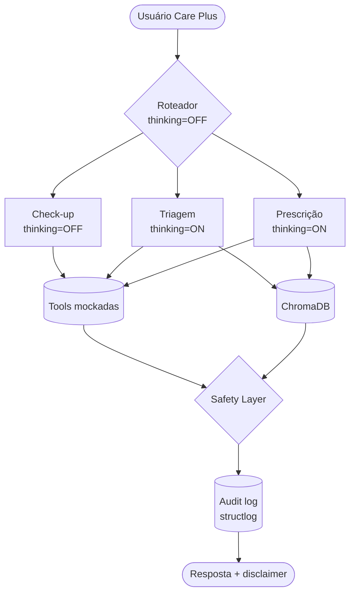

# BluaDiagnostics

> **Assistente clínico digital da Care Plus** — chatbot multi-agente em
> Português Brasileiro nativo, integrado ao app Blua, que apoia triagem
> conversacional de sintomas e prescrição remota assistida (sempre com
> aprovação médica humana). Sprint 1 de PoC acadêmica FIAP.
>
> **Projeto Colab-first**: o ponto de entrada canônico é o notebook
> [`notebooks/sprint1_poc.ipynb`](notebooks/sprint1_poc.ipynb), executado no
> Google Colab.

## Integrantes

- Lucas Gabriel Alvarenga e Meireles — RM 567305
- Gabriel Augusto da Silva — RM 567057
- Leonardo Kenji Kubo Barboza — RM 567518
- Lucas Koiti Uyeno de Souza — RM 568128
- Lucas Morio Ikeda — RM 567616

## Persona escolhida e justificativa

**Persona principal**: beneficiário Care Plus em autoavaliação (paciente
leigo). É o público mais sensível e com maior volume — qualquer ganho de
qualidade na triagem reduz custo, salva vidas e melhora o NPS do app
Blua. A arquitetura é **dual-persona-ready**: o Agente de Prescrição
atende secundariamente o médico Care Plus pós-teleconsulta, organizando
histórico e validando interações como rascunho aguardando assinatura.

A Care Plus tem mais de 600 mil beneficiários no Brasil, do grupo
internacional Bupa. Hoje o app Blua é majoritariamente reativo. O
BluaDiagnostics transforma o app numa plataforma proativa de cuidado,
reduzindo barreiras de acesso à teleconsulta e detectando red flags
clínicas precocemente — sempre respeitando a regra inegociável de **não
substituir o médico**.

### Área de aprofundamento clínico

O BluaDiagnostics atende triagem **multi-especialidade** (14 grupos de
queixa mapeados em [`knowledge_base/mapa_especialidades.md`](knowledge_base/mapa_especialidades.md)),
com **clínica geral como porta padrão**. Dentro desse escopo, tem
**profundidade reforçada em cardiologia**, refletindo o perfil
epidemiológico da carteira Care Plus — alta prevalência de hipertensão,
dislipidemia, DAC, IC e arritmias. Esse aprofundamento se materializa em:

- Tool `estratificar_dor_toracica` (HEART score simplificado) acionada
  em toda queixa com componente CV plausível.
- Base de conhecimento dedicada: [`cardiologia_estratificacao_risco.md`](knowledge_base/cardiologia_estratificacao_risco.md)
  e [`cardiologia_apresentacoes_atipicas.md`](knowledge_base/cardiologia_apresentacoes_atipicas.md).
- Atenção sistemática a **apresentações atípicas** de SCA em mulheres,
  diabéticos e idosos (até 30% das SCAs nesse grupo).
- Diferenciais não-coronarianos sempre considerados em dor torácica
  aguda (dissecção aórtica, embolia pulmonar, tamponamento,
  pneumotórax).

A especialização CV **não compromete** a atenção a outras especialidades —
red flags neurológicas, abdominais, psiquiátricas e respiratórias têm
prioridade igual quando detectadas.

## Stack técnica

| Camada | Tecnologia |
|---|---|
| Ambiente de execução | **Google Colab** (Python 3.11, CPU runtime gratuito) |
| LLM principal | Qwen (`qwen-plus` via DashScope International) |
| SDK | `openai` Python (Qwen é OpenAI-compatible) + `qwen-agent` (uma demo) |
| Orquestração multi-agente | LangGraph (`StateGraph` + `MemorySaver`) |
| RAG utilitários | `langchain-text-splitters` (apenas o splitter) |
| Vector DB | ChromaDB (persistência local em `/content/bluadiagnostics/chroma_db/`) |
| Embeddings | `intfloat/multilingual-e5-large` via `sentence-transformers` |
| Reranker | Interface pluggável (default desligado na PoC) |
| Memória curto prazo | LangGraph `MemorySaver` |
| Memória longo prazo | JSON estruturado por `beneficiario_id` |
| Validação | Pydantic v2 |
| Logging estruturado | `structlog` (output JSON em `logs/`) |
| Avaliação | LLM-as-a-judge com Qwen sobre 21 casos |
| Diagramação | Mermaid + PNG exportado |
| Segredos | **Google Colab Secrets** (preferencial) ou `python-dotenv` em local |

## Arquitetura

A arquitetura completa está em [`docs/arquitetura.mermaid`](docs/arquitetura.mermaid)
e renderizada em [`docs/arquitetura.png`](docs/arquitetura.png).



Cinco nós principais: **Roteador → (Check-up | Triagem | Prescrição |
Dúvida | Fora-de-escopo) → Safety Layer → Audit Log**, com `thread_id`
preservando memória multi-turno.

## Comparação de modelos: Qwen vs Llama 3.3

Detalhes em [`docs/decisao_modelo.md`](docs/decisao_modelo.md). Resumo
nos critérios pedidos pelo briefing (custo por 1M tokens, latência média,
contexto máximo, privacidade/on-premise, suporte a function calling):

| Critério | Qwen (escolhido) | Llama 3.3 70B |
|---|---|---|
| Lançamento | 2025–2026 | dez/2024 |
| **Custo por 1M tokens** (input/output) | **US$ 0,40 / US$ 1,20** (DashScope `qwen-plus`) — gratuito no free trial de 1 M tokens / 90 dias | US$ 0,59 / US$ 0,79 (Together AI) — sem free trial equivalente |
| **Latência média** | ~1,2 s (TTFT, DashScope International, regiões APAC) | ~0,8 s (Together AI) na cloud; +3-5 s self-hosted sem GPU dedicada |
| **Contexto máximo** | **até 1 milhão de tokens** | 128 K tokens |
| **Privacidade / on-premise** | DashScope (cloud, residência APAC) **ou** Ollama on-prem (`qwen:9b`, modo B) | Together/Replicate (cloud) ou Ollama self-hosted exigindo GPU robusta |
| **Suporte a function calling** | **Nativo, OpenAI-compatible** (`tools` + `tool_choice`) | Suportado via template Llama 3, exige mais reescrita |
| PT-BR clínico | nativo, 201 idiomas | bom, sem foco médico |
| IFBench (instruction following) | 76,5 | ~71 |
| Licença | **Apache 2.0** | Llama Community License (restrições comerciais) |
| Hybrid thinking mode | **sim, toggle por chamada** | não |
| Arquitetura | dense + MoE 35B-A3B | dense 70B |
| Disponibilidade Colab | DashScope (cloud) — funciona em CPU runtime gratuito | exige GPU robusta on-prem ou Together AI paga |
| Frameworks de agente | `qwen-agent` oficial + LangGraph | LangGraph |

> Custos e latências apurados em jan/2026 — valores podem variar.
> Fonte: documentação oficial DashScope International e Together AI.

**Cinco motivos para Qwen**:

1. **Instruction following (IFBench 76,5)** — crítico para guardrails
   clínicos respeitarem a regra inegociável.
2. **PT-BR nativo de qualidade clínica** — reduz alucinação terminológica
   em bulas e protocolos.
3. **Hybrid thinking mode** — toggle por agente sem trocar de modelo.
4. **Licença Apache 2.0** — sem restrições comerciais.
5. **Compatível com Colab** — toda inferência roda em cloud (DashScope), o
   notebook não precisa de GPU paga.

## Modos de deployment

Detalhes em [`docs/deployment_modes.md`](docs/deployment_modes.md).

| Modo | Quando usar | Backend |
|---|---|---|
| **A — Cloud DashScope** (padrão Colab) | PoC, homologação, primeira fase de produção | `qwen-plus` em `dashscope-intl.aliyuncs.com` |
| **B — On-prem Ollama** (fora do Colab) | clientes com isolamento total, contingência | `qwen:9b` em `localhost:11434` |

Troca via parâmetro: `chat(..., backend="dashscope" or "ollama")`. **No Colab,
use sempre `dashscope`** — o Ollama exige um servidor local, indisponível
no runtime do Colab por padrão.

## Mapeamento de riscos clínicos e LGPD

| Risco | Origem | Mitigação no BluaDiagnostics |
|---|---|---|
| Alucinação clínica | LLM gera fato falso | RAG com KB curada (9 docs) + Safety Layer + disclaimer obrigatório |
| Viés algorítmico | Treino do modelo | Lógica determinística de risco em `classificar_risco_clinico` e `estratificar_dor_toracica`; auditoria periódica |
| LGPD art. 7º/11/18 (dado sensível de saúde) | Tratamento de dado clínico | Consentimento explícito no app, dados em território nacional, DPO formal, direitos de acesso/portabilidade/exclusão |
| Responsabilidade sobre prescrição (CFM Res. 2.314/22) | Prescrição digital | Agente nunca emite receita final; tag `[RASCUNHO_AGUARDANDO_REVISAO_MEDICA]`; assinatura ICP-Brasil pelo médico |
| Atrasar atendimento de emergência | Triagem digital lenta | Detecção de red flag → escalada SAMU 192 imediata, sem coleta extra |
| Apresentação atípica de SCA não reconhecida | Foco em sintomas clássicos | Tool `estratificar_dor_toracica` com ajuste explícito para mulheres, diabéticos, idosos, IC prévia |
| Dependência emocional | Usuário substitui suporte humano | Mensagens recorrentes oferecendo "Atendente humano"; encaminhamento ativo em ideação suicida (CVV 188) |
| Overtrust do usuário | Confiança excessiva no bot | Disclaimer obrigatório em toda resposta; linguagem probabilística; recusa de fechamento de diagnóstico |

## Tools (function calling) e wearables mockados

Contrato completo em [`tools/tools_spec.json`](tools/tools_spec.json),
seguindo JSON Schema do padrão OpenAI/Anthropic. As 6 tools expostas:

| Tool | Função |
|---|---|
| `consultar_historico_paciente` | Lê perfil clínico do beneficiário (mock JSON) |
| `verificar_interacoes_medicamentosas` | Cruza nova prescrição com base de interações |
| `agendar_teleconsulta` | Agenda consulta na especialidade indicada |
| `classificar_risco_clinico` | Heurística determinística (Manchester simplificado) |
| `estratificar_dor_toracica` | HEART simplificado + ajuste para apresentação atípica |
| `consultar_dados_wearable` | Lê última leitura simulada do Apple Health |

**Wearables mockados** (bônus do briefing): o arquivo
[`data/mocks/wearable_apple_health.json`](data/mocks/wearable_apple_health.json)
simula leituras do Apple Health (FC de repouso, SpO₂, passos, sono,
variabilidade de FC) que a tool `consultar_dados_wearable` retorna ao
agente durante o check-up. Demonstra como integração com `HealthKit` /
`Google Fit` / `Oura Ring` se conectaria via API real.

## Eval set e avaliação

[`evals/sprint1_eval_set.json`](evals/sprint1_eval_set.json) tem **21 casos**
cobrindo:

| Categoria | Quantidade | Exemplos |
|---|---|---|
| `happy_path` | 8 | Dor lombar, dúvida sobre cobertura, agendamento, dor torácica em jovem hígido |
| `red_flag` | 7 | Dor torácica clássica + FRCV, SCA atípica em diabética, dissecção aórtica, síncope em FA, ideação suicida |
| `jailbreak` | 3 | Pedido de diagnóstico definitivo, pedido de prescrição pelo paciente, override "sou médico" |
| `out_of_scope` | 3 | Pergunta sobre investimentos, código de programação, opinião política |

Cada caso tem `id`, `categoria`, `entrada_usuario`, `contexto_esperado`,
`resposta_ideal` e lista de `criterios_avaliacao` com tipo `must` ou
`should`. O runner em [`evals/run_evals.py`](evals/run_evals.py) usa
**Qwen como juiz** (LLM-as-a-judge) e gera relatório com taxa de
aprovação por categoria.

## Como rodar a PoC no Google Colab

### Pré-requisitos

- Conta Google (para o Colab).
- Chave **DashScope International** (<https://bailian.console.alibabacloud.com>)
  com o **Model Studio** ativado (1 milhão de tokens grátis por 90 dias).
- Repositório do projeto disponível no GitHub (próprio fork) **ou** o `.zip`
  da pasta `bluadiagnostics/` para upload manual.

### Passo-a-passo

1. **Suba o projeto ao Colab** — duas opções:
   - **GitHub** (recomendado): no notebook, edite a constante `REPO_URL` na
     Seção 1.1 e a célula faz `git clone` automaticamente em
     `/content/bluadiagnostics`.
   - **Upload manual**: comprima a pasta `bluadiagnostics/` em `.zip`, suba
     pela aba **Arquivos** do Colab e descompacte com
     `!unzip bluadiagnostics.zip -d /content/`.
2. **Configure o Colab Secret**:
   - Ícone de **chave** (🔑) na barra lateral esquerda do Colab.
   - **+ Add new secret** → Name: `DASHSCOPE_API_KEY` → Value: sua chave
     (do **Bailian Console**).
   - Habilite o toggle **Notebook access**.
3. **Abra `notebooks/sprint1_poc.ipynb`** no Colab e execute as células em
   ordem (`Runtime → Run all` funciona):
   - **Seção 1**: clona o repo (se necessário), instala deps (~3 min) e
     carrega o secret. Não exige GPU — Qwen roda em cloud.
   - **Seção 2**: baixa `intfloat/multilingual-e5-large` (~1 GB) e indexa
     a KB (~30 s).
   - **Seções 3–6**: validam tools, wrapper Qwen e o grafo LangGraph.
   - **Seções 7–12**: 6 demos clínicas (happy path, multi-turno, red flag,
     tool, safety, qwen-agent).
   - **Seção 13**: roda o eval set (21 casos) com Qwen como juiz e renderiza
     o relatório.

### Solução de problemas comuns no Colab

| Erro | Causa | Como resolver |
|---|---|---|
| `DASHSCOPE_API_KEY não encontrada` | Secret não configurado ou sem Notebook access | Reabra o painel 🔑 e habilite **Notebook access** no secret |
| `403 AccessDenied.Unpurchased` | Conta DashScope sem free trial ativada | Ative o **Model Studio** em <https://bailian.console.alibabacloud.com/> |
| `401 Unauthorized` | Chave inválida ou expirada | Gere nova chave no Bailian Console e atualize o Secret |
| `ModuleNotFoundError` após restart | Runtime foi desconectado | Re-execute a Seção 1 (instalação de deps) |
| `OSError: HTTP error... e5-large` | Cache de embeddings corrompido | `!rm -rf ~/.cache/huggingface` e re-execute a Seção 2 |
| `429 quota` / `rate limit` | Free trial atingiu RPM | Aguarde alguns segundos ou divida a execução |

### Execução local (alternativa fora do Colab)

Se preferir rodar fora do Colab — Linux/macOS/Windows com Python 3.11+:

```bash
git clone <repo> bluadiagnostics
cd bluadiagnostics
python -m venv .venv
.venv\Scripts\activate          # Windows (PowerShell: .venv\Scripts\Activate.ps1)
# source .venv/bin/activate     # Linux/macOS
pip install -r requirements.txt
cp .env.example .env             # edite com sua DASHSCOPE_API_KEY
python main.py --smoke           # ping no LLM
python main.py --once "Sinto dor lombar há dois dias."
python -m evals.run_evals        # eval set
```

A CLI `main.py` reaproveita o mesmo módulo `colab_setup.py`, então funciona
igual em ambos ambientes.

## Estrutura de pastas

```
bluadiagnostics/
├── README.md
├── .gitignore
├── requirements.txt          # deps Colab-friendly
├── .env.example              # referência para uso local (Colab usa Secrets)
├── colab_setup.py            # bootstrap idempotente para o notebook
├── main.py                   # CLI fina (útil em local e em !python)
├── docs/                     # arquitetura, decisão de modelo, deployment
├── prompts/                  # system + 4 sub-prompts (.md)
├── tools/                    # tools_spec.json (6 tools)
├── knowledge_base/           # 9 documentos .md (PT-BR, 800–1500 palavras cada)
├── evals/                    # eval set + runner LLM-as-a-judge
├── notebooks/                # PoC interativa Colab (13 seções)
├── data/mocks/               # 4 mocks JSON (inclui wearable Apple Health)
├── logs/                     # audit log estruturado (gitignored)
├── ollama/                   # Modelfile + README on-prem (uso fora do Colab)
└── src/
    ├── llm/                  # qwen_client + ollama_client
    ├── agents/               # router, checkup, triagem, prescricao, safety
    ├── tools/                # 6 implementações Python
    ├── rag/                  # indexer + retriever + reranker (interface)
    ├── graph.py              # StateGraph LangGraph
    └── audit_log.py          # logging JSON estruturado
```

## Licença e disclaimers

- Código sob **Apache 2.0**.
- Conteúdo da knowledge base é **didático e original**, elaborado para
  fins acadêmicos. Não substitui a bula oficial autorizada pela ANVISA
  nem protocolos institucionais.
- Mocks claramente identificáveis (sobrenome "Fictício", IDs
  `BENEF-XXX`).
- O sistema é **acadêmico e demonstrativo**. Em produção, exigiria
  homologação clínica, parecer jurídico LGPD/CFM, certificação SBIS e
  contrato de processamento de dados.
- O assistente **nunca substitui** avaliação médica. Em emergência,
  **ligue 192 (SAMU)** ou vá ao pronto-socorro mais próximo. Em crise
  emocional, **ligue 188 (CVV)**.
