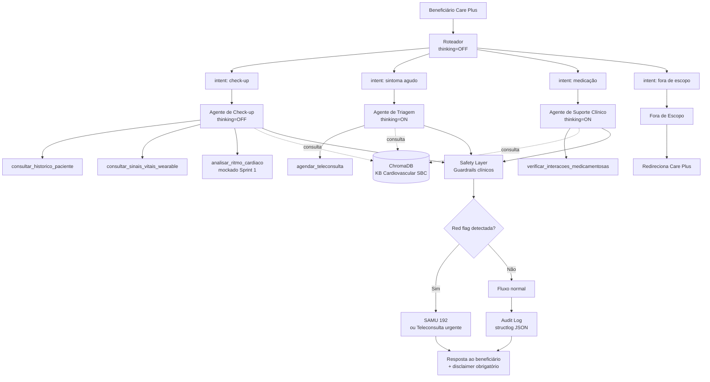

```mermaid
flowchart TD

%% =========================
%% Entrada
%% =========================

A[Beneficiário Care Plus] --> B[Roteador<br/>thinking=OFF]

%% =========================
%% Intenções
%% =========================

B --> C1[intent: check-up]
B --> C2[intent: sintoma agudo]
B --> C3[intent: medicação]
B --> C4[intent: fora de escopo]

%% =========================
%% Fluxos principais
%% =========================

C1 --> D1[Agente de Check-up<br/>thinking=OFF]
C2 --> D2[Agente de Triagem<br/>thinking=ON]
C3 --> D3[Agente de Suporte Clínico<br/>thinking=ON]
C4 --> D4[Fora de Escopo]

%% =========================
%% Fora de escopo
%% =========================

D4 --> D5[Redireciona Care Plus]

%% =========================
%% Ferramentas do Check-up
%% =========================

D1 --> T1[consultar_historico_paciente]
D1 --> T2[consultar_sinais_vitais_wearable]
D1 --> T3[analisar_ritmo_cardiaco<br/>mockado Sprint 1]

%% =========================
%% Ferramentas clínicas
%% =========================

D2 --> T4[agendar_teleconsulta]
D3 --> T5[verificar_interacoes_medicamentosas]

%% =========================
%% Base de conhecimento
%% =========================

KB[(ChromaDB<br/>KB Cardiovascular SBC)]

D1 -. consulta .-> KB
D2 -. consulta .-> KB
D3 -. consulta .-> KB

%% =========================
%% Safety Layer
%% =========================

SL[Safety Layer<br/>Guardrails clínicos]

D1 --> SL
D2 --> SL
D3 --> SL

%% =========================
%% Red flags
%% =========================

SL --> RF{Red flag detectada?}

RF -->|Sim| EM[SAMU 192<br/>ou Teleconsulta urgente]
RF -->|Não| FN[Fluxo normal]

%% =========================
%% Saída
%% =========================

FN --> LOG[Audit Log<br/>structlog JSON]

LOG --> RESP[Resposta ao beneficiário<br/>+ disclaimer obrigatório]

EM --> RESP
```